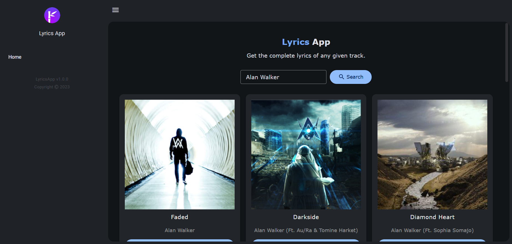
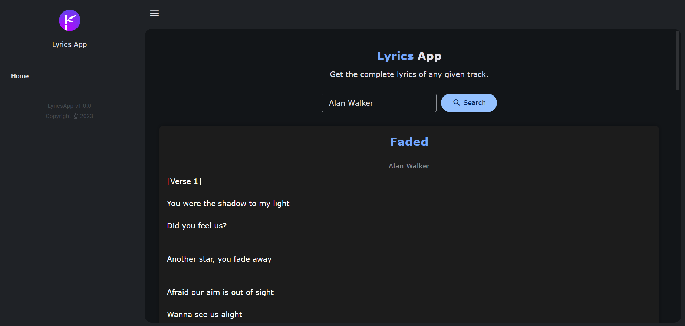

# Lyrics App - Blazor Server

## Description

Lyrics App is a web application built with Blazor Server that allows users to search for song lyrics of their favorite artists. The app fetches data from a lyrics API and displays the lyrics in a user-friendly format.

## Features

- Search for song lyrics by artist name or song title.
- View lyrics and song information, such as artist name, song title, and album cover.
- Responsive design for a seamless experience on desktop and mobile devices.

## Technologies Used

- Blazor Server
- C# (.NET/ASP.NET)
- HTML, CSS
- Lyrics API (Genius - Song Lyrics API)
- Visual Studio
- Radzen Blazor Studio

## Installation

1. Clone this repository: `git clone https://github.com/ytc8717/lyrics-app-blazor.git`
2. Open the project in Visual Studio or your preferred IDE.
3. Build and run the application.

## Configuration

To use the Lyrics App, you must obtain an API key from the lyrics API provider (https://rapidapi.com/Glavier/api/genius-song-lyrics1). Once you have the API key, follow these steps:

1. Open `GeniusApiService.cs` and replace `apiKey` with your API key.

## Screenshots

